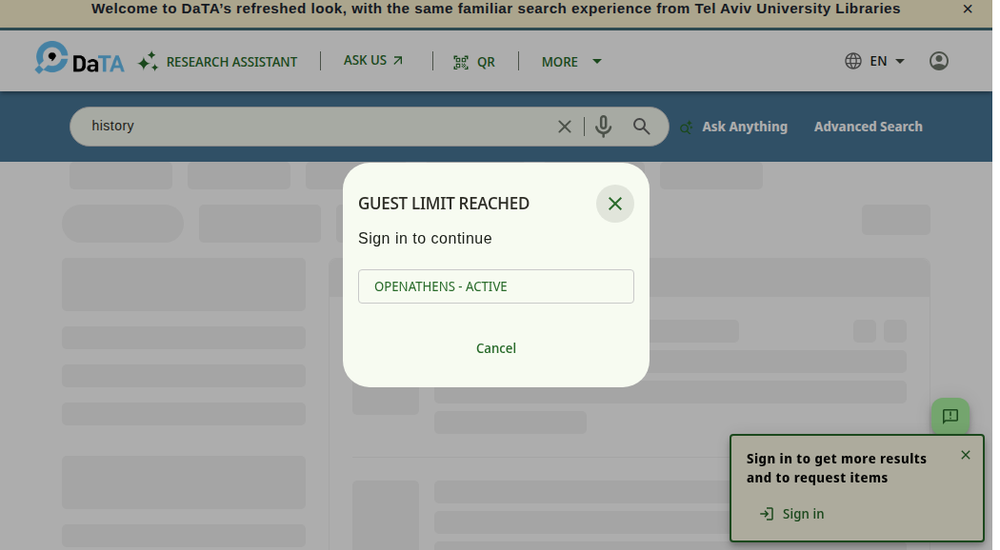
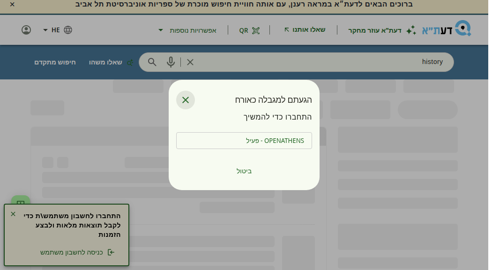

# Guest 500-result paging limit & reCaptcha — what it is and what TAU has to do

**Date:** 2026-09-07
**Trigger:** MALMAD notice that the September 2026 Primo release is live on the SB environment,
asking TAU to look at guest paging beyond 500 results and at the reCaptcha mechanism
("אצלנו לא מוגדר").
**Scope:** Alma/Primo VE back-office configuration only. **Nothing in this repo changes.**

---

## 1. The one-paragraph version

Guests are cut off at result 500. That is **already live in TAU production**, not just SB — verified
today. Without reCaptcha the guest gets a modal saying "GUEST LIMIT REACHED — sign in to continue".
With reCaptcha configured, the guest passes a checkbox challenge and keeps browsing from where they
were. TAU has reCaptcha switched off in both PROD and SB. Turning it on is a back-office change, but
it is **effectively irreversible without an Ex Libris Support case**, and it also puts a captcha in
front of Export-to-Email and Give Us Feedback. There is also a Google-side complication that the Ex
Libris instructions do not mention (§5).

---

## 2. What we verified live (Tier B)

Guest session (not signed in), Chromium via Playwright, 2026-09-07, view `972TAU_INST:NDE`,
query `history`, 10 results per page.

| Environment | Host | Result |
|---|---|---|
| Premium Sandbox | `tau-psb.primo.exlibrisgroup.com` | Paging normal up to offset 480 (results 481–490). Page 51 (offset 500 → results 501–510) is blocked by a modal. |
| **Production** | `tau.primo.exlibrisgroup.com` | **Identical.** Same block, same modal, same offset. |

The modal, English UI:

> **GUEST LIMIT REACHED**
> Sign in to continue
> `OPENATHENS - ACTIVE`
> Cancel



Hebrew UI — fully translated already, no label work needed:

> **הגעתם למגבלה כאורח**
> התחברו כדי להמשיך
> `OPENATHENS - פעיל`
> ביטול



Other observed behaviour:

- The results behind the modal never render — the page shows skeleton placeholders.
- **Cancel** drops the user back to offset 480, i.e. the last page they were allowed to see.
- A deep link with `offset=500` in the URL is normalised back to `offset=0` on a fresh page load.
  (So is `offset=100` — this is generic parameter normalisation, not the limit doing the work.)

**Captcha state, from the public config endpoint** `/primaws/rest/pub/configuration/vid/972TAU_INST:NDE`,
on **both** hosts:

```
"Activate Captcha [Y/N]" : "N",
"Public Captcha Key"     : ""
```

That confirms the report: not configured, in either environment.

### What we did **not** test

- Signed-in browsing beyond 500 (needs patron credentials).
- The documented "signing in resets the result set to page 1" behaviour.
- The reCaptcha flow itself — impossible while the keys are unset.

---

## 3. What Ex Libris documents (Tier A)

**September 2026 release — "Improved Offset-Limit Handling" (URM-331013).** The guest offset limit
goes from 250 to 500, and institutions get the option to let guests continue past it via CAPTCHA
approval. The 500 cap itself was introduced as a temporary anti-bot measure in the April and May
2026 releases, after automated traffic began degrading service.

**The three behaviours** ([Search Limitations](https://knowledge.exlibrisgroup.com/Primo/Product_Documentation/020Primo_VE/Primo_VE_(English)/030Primo_VE_User_Interface/Search_Limitations)):

| User | reCaptcha off (TAU today) | reCaptcha on |
|---|---|---|
| Signed in | Unlimited paging | Unlimited paging |
| Guest, under 500 | Normal | Normal |
| Guest, at 500 | Prompted to sign in. On sign-in the result set **restarts at page 1** and the offset is discarded. | Passes the challenge, **continues from where they left off**. |

Ex Libris explicitly recommends enabling reCaptcha for institutions with high guest traffic.

**Where the keys go** ([Configuring reCaptcha for Primo VE](https://knowledge.exlibrisgroup.com/Primo/Product_Documentation/020Primo_VE/Primo_VE_(English)/120Other_Configurations/Getting_reCaptcha_Site_and_Secret_Keys)):

1. Alma → **Configuration Menu > Discovery > Other > Captcha configuration**
2. Open the **Captcha Keys** mapping table
3. Fill **reCaptcha Site key** and **reCaptcha Secret key**
4. **Customize** (first time) / **Save**

**Labels**, if the captcha error strings ever need Hebrew:
Configuration Menu > Discovery > Display Configuration > Labels → **Send Email and Sms Labels**
code table → `captcha.notselected`, `captcha.invalidSiteKey`, `captcha.publickey`, `captcha.privatekey`.

---

## 4. The three things Ex Libris' page says that are easy to miss

1. **It cannot be turned off again from the back office.** Verbatim: *"Once saved, this
   functionality cannot be disabled manually; the keys can be modified, but they cannot be left
   undefined. To disable this functionality, open a Support ticket."* Treat enabling as a one-way
   door.
2. **It is not only about paging.** The same keys switch reCaptcha on for the **Export to Email**
   action and the **Give Us Feedback** tool. Those are used far more often than "guest pages past
   result 500", so this decision changes the everyday UX, not an edge case.
3. **"Report a problem" in the NDE UI is not covered** — Ex Libris says a different security
   mechanism will come for it later.

---

## 5. The Google-side complication (not in the Ex Libris instructions)

Ex Libris' linked PDF (*How to get reCAPTCHA keys*) tells you to go to `google.com/recaptcha`,
tick **reCAPTCHA v2**, add your domain, and copy the Site and Secret keys. So Primo wants a
**v2 checkbox** key pair using the legacy `siteverify` verification.

Two things have changed on Google's side since that PDF was written, and both need checking before
anyone promises a date:

- **Classic key creation is being wound down.** New reCAPTCHA keys are created in the **Google Cloud**
  console. To get something Primo can use, create a key with challenge type **Challenge (v2)**, then
  on the key's detail page open **Integration → Use Legacy Key** to reveal the legacy secret key that
  `siteverify` (and therefore Primo) expects. This needs a **Google Cloud project** owned by someone
  at TAU.
- **The free tier was cut on 2026-04-02**, reportedly from 1,000,000 to **10,000 assessments per
  month per organisation**, aggregated across all keys and all projects. Above that, billing applies.
  Because enabling reCaptcha also covers email-export and feedback (§4.2), the monthly assessment
  count is not just the handful of guests who page past 500.
  *Verify the current number on Google's own pricing page before relying on it — this figure comes
  from third-party reporting, not from Google's documentation directly.*

**Domains to register on the key:** `tau.primo.exlibrisgroup.com` and
`tau-psb.primo.exlibrisgroup.com`. If TAU ever serves Primo from a `tau.ac.il` vanity host, that
must be on the key too — no such host was found while researching this, so confirm.

---

## 6. Sandbox refresh interaction

The Premium Sandbox is a static image of PROD, refreshed twice a year (the Sunday after the February
and August Alma releases). Consequences for this piece of work:

- Captcha keys configured **in PROD** will be copied into SB at the next refresh. Nothing to add to
  the [SB refresh playbook](../reference/sb-refresh-playbook.md).
- Captcha keys configured **only in SB** are destroyed at the next refresh. Fine for a one-off test,
  useless as a permanent state.
- The Google key must list the SB domain as well, or the widget will fail there after the refresh.

---

## 7. The decision, and what it costs

**Option A — leave it off (status quo).** Guests stop at result 500 and are told to sign in. If they
sign in, they lose their place and restart at page 1. Zero work, zero cost, no Google dependency.

**Option B — enable reCaptcha.** Guests verify once and carry on from where they were. Costs:
a one-way door in the back office; a captcha added to Export-to-Email and Give Us Feedback for
everyone; a Google Cloud project and possibly a billing account; and a privacy/accessibility review,
because reCaptcha loads Google scripts and sets Google cookies on a page that carries TAU's
Accessibility Statement and Privacy and Data Protection notices.

**Recommendation: Option B, but not yet.** It is the better end state — Ex Libris recommends it, and
the current guest experience (lose your place, start over) is worse than a checkbox. But do not touch
the Captcha Keys table until three questions have answers, because the setting cannot be undone
without a Support case:

1. Who at TAU owns a Google Cloud project that can hold the key, and is billing available if the
   10,000/month free tier is exceeded?
2. Does the library accept a Google captcha in front of Export-to-Email and Give Us Feedback — and
   do the Privacy and Accessibility statements need updating first?
3. How many guest sessions actually reach result 500? If the answer is "almost none", Option A is
   defensible and free.

### Separate observation, worth its own check

The sign-in modal offers exactly one route: **OPENATHENS - ACTIVE**. If that is not the login TAU
patrons recognise, then today's no-captcha fallback is worse than the documentation makes it sound —
the guest is being told to sign in via a method they may not have. Worth confirming against the
production authentication profiles regardless of the captcha decision.

---

## 8. Suggested reply to MALMAD (Hebrew)

> בדקנו. המגבלה כבר פעילה אצלנו **גם בפרודקשן**, לא רק ב-SB: אורח שמגיע לתוצאה 500 מקבל חלונית
> "הגעתם למגבלה כאורח / התחברו כדי להמשיך". ה-reCaptcha אכן לא מוגדר אצלנו — לא ב-PROD ולא ב-SB
> (`Activate Captcha = N`, מפתח ריק). ההגדרה עצמה פשוטה (Discovery > Other > Captcha configuration),
> אבל שלוש נקודות עוצרות אותנו לפני הפעלה: (1) אחרי שמירה **אי אפשר לכבות** בלי פנייה לתמיכה;
> (2) אותם מפתחות מפעילים captcha גם על שליחת מייל ועל טופס המשוב, לא רק על הדפדוף;
> (3) גוגל שינתה את מנגנון המפתחות — צריך פרויקט ב-Google Cloud, והמכסה החינמית ירדה ל-10,000
> אימותים בחודש. אנחנו בודקים את השלושה ונחזור עם המלצה.

---

## Sources

- [Primo VE 2026 Release Notes](https://knowledge.exlibrisgroup.com/Primo/Release_Notes/002Primo_VE/2026/010Primo_VE_2026_Release_Notes) — September, "Improved Offset-Limit Handling" (URM-331013)
- [Search Limitations](https://knowledge.exlibrisgroup.com/Primo/Product_Documentation/020Primo_VE/Primo_VE_(English)/030Primo_VE_User_Interface/Search_Limitations)
- [Paging through Search Results in the NDE UI](https://knowledge.exlibrisgroup.com/Primo/Product_Documentation/020Primo_VE/Primo_VE_(English)/End_User_Help_(NDE_UI)/Paging_through_Search_Results_in_the_NDE_UI)
- [Configuring reCaptcha for Primo VE](https://knowledge.exlibrisgroup.com/Primo/Product_Documentation/020Primo_VE/Primo_VE_(English)/120Other_Configurations/Getting_reCaptcha_Site_and_Secret_Keys) — and its linked PDF *How to get reCAPTCHA keys*
- [Create reCAPTCHA keys for websites (Google Cloud)](https://docs.cloud.google.com/recaptcha/docs/create-key-website)
- [Map legacy terminology to Google Cloud console](https://docs.cloud.google.com/recaptcha/docs/reconcile-legacy-terminology) — legacy secret key / siteverify
- [Alma Sandbox Environments](https://knowledge.exlibrisgroup.com/Alma/Product_Documentation/010Alma_Online_Help_(English)/010Getting_Started/040Alma_Sandbox_Environments) — refresh cadence
